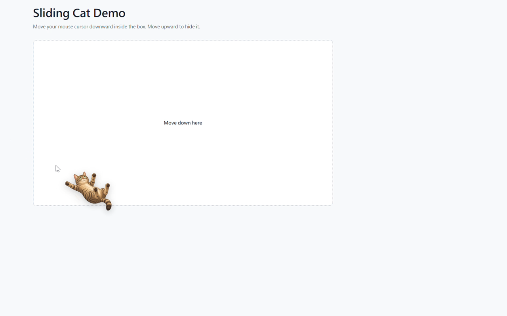

# Sliding Cat Cursor for Chrome Extension



Sliding Cat Cursor for Chrome Extension is a tiny Chrome/Edge extension that
shows a cutout sliding cat near your cursor when you move the mouse downward.
Move upward and the cat fades away.

This open-source GitHub build uses the cutout cat image from the original viral
photo. Please verify image rights before commercial redistribution.

## Download and Go to Chrome Developer Mode

Download the latest unpacked-extension zip:

[sliding-cat-cursor-v1.1.4.zip](dist/sliding-cat-cursor-v1.1.4.zip)

1. Download `sliding-cat-cursor-v1.1.4.zip`.
2. Unzip it.
3. Open Chrome or Edge.
4. Go to `chrome://extensions` or `edge://extensions`.
5. Turn on `Developer mode`.
6. Click `Load unpacked`.
7. Select the unzipped extension folder.

The cat will appear on normal webpages when your cursor moves downward.

## For Extension Developers

This repository is the Chrome extension version of Sliding Cat Cursor. The
browser extension source is in `extension/`.

Project layout:

- `extension/manifest.json`: Chrome Manifest V3 config
- `extension/content.js`: cursor movement detection and cat overlay
- `extension/popup.html`, `popup.css`, `popup.js`: popup settings UI
- `extension/assets/sliding-cat.png`: cutout cat image asset
- `extension/icons/`: extension icons
- `dist/`: packaged zip builds for manual install
- `docs/assets/`: screenshots and listing assets

### Run Locally For Development

1. Open Chrome or Edge.
2. Go to `chrome://extensions` or `edge://extensions`.
3. Turn on `Developer mode`.
4. Click `Load unpacked`.
5. Select the `extension/` folder from this repo.
6. After code changes, click the extension reload button and refresh the test
   page or webpage.

### Repackage

Zip the contents of `extension/`, not the folder itself. The zip must contain
`manifest.json` at the top level.

On macOS/Linux:

```bash
cd extension
zip -r ../dist/sliding-cat-cursor.zip .
```

On Windows PowerShell:

```powershell
Compress-Archive -Path extension\* -DestinationPath dist\sliding-cat-cursor.zip -Force
```

### Permission Notes

The extension uses `storage` to save local settings. It uses a content script on
webpages so the visual cursor effect can appear automatically. The content
script listens only to pointer movement direction and does not inspect page
content.

## Features

- Appears only when the cursor moves downward
- Fades when the cursor moves upward
- Mirrors direction when moving down-left
- Adjustable cat size
- Adjustable sensitivity
- Simple on/off switch
- No tracking or analytics

## Privacy

This extension does not collect, sell, transmit, or share user data.

It stores only local settings such as:

- enabled or disabled state
- cat height
- downward sensitivity

The content script listens only to pointer movement direction so it can show or
hide the local cat image. It does not inspect page text, forms, links, cookies,
account information, browsing history, or page content.

## License

MIT
